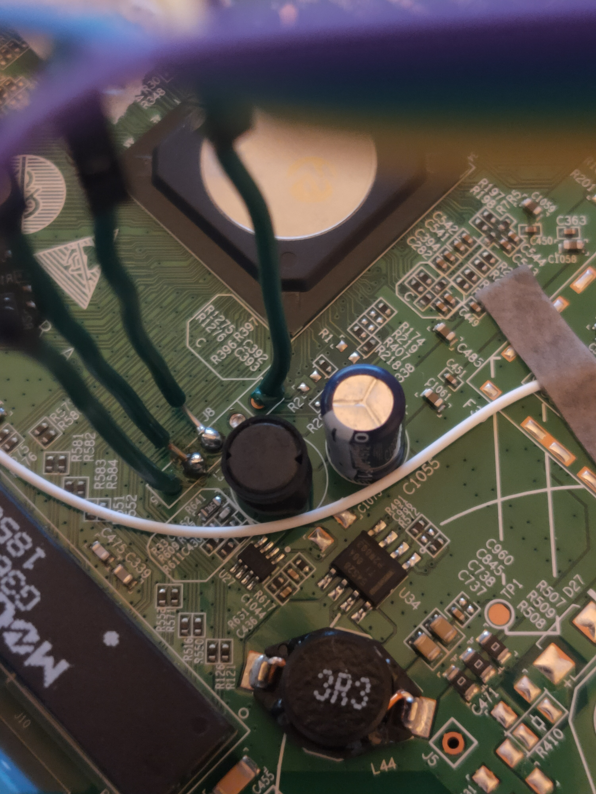
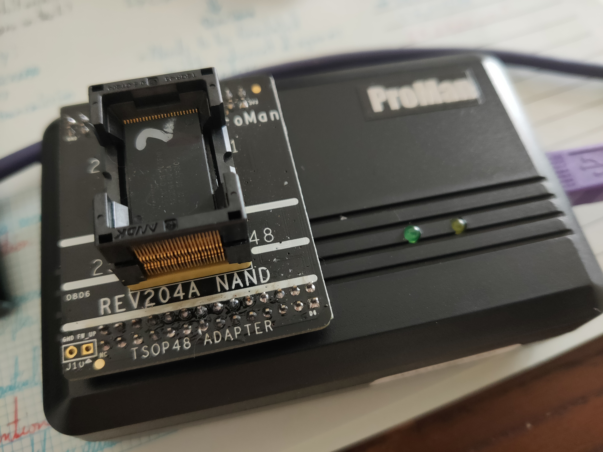
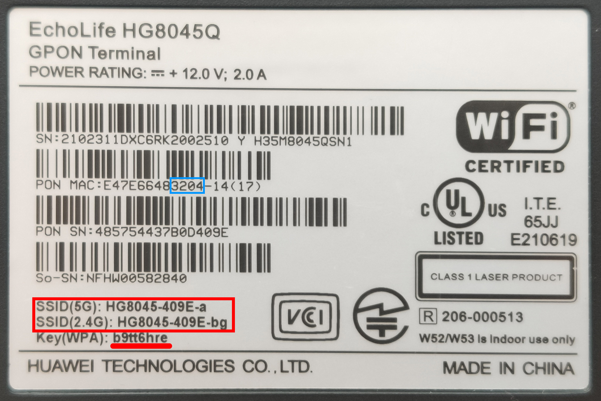
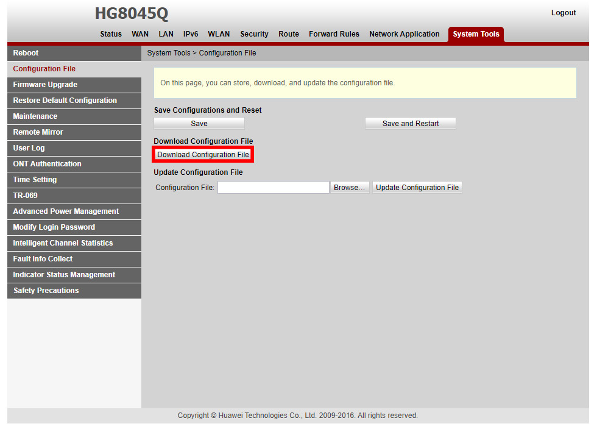
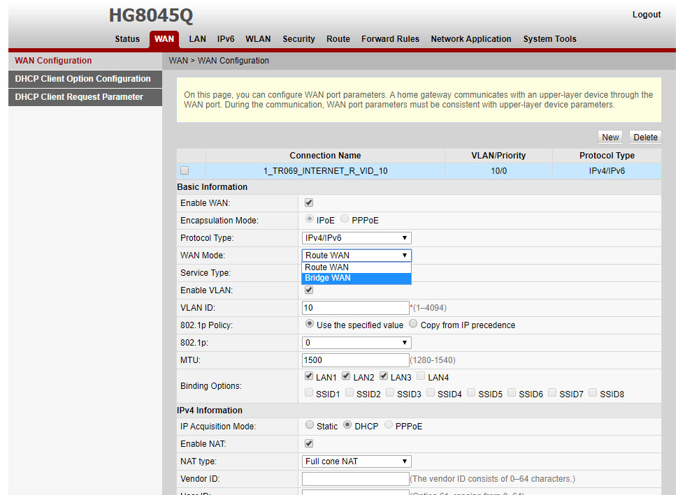

# PWNED: HG8045Q
This is an ongoing project aimed at reverse engineering modern Huawei ONT implementations to evaluate their security.

## Note for those reading the news articles with this page quoted: among the other ONU provided by Nuro (ZTE F660A) has also been hacked and presents a greater security risk than the HG8045Q. Also please note that ALL OF THE ONU AND ROUTERS PROVIDED BY ALL JAPANESE INTERNET PROVIDERS ARE ALL VULNERABLE IN SOME WAY. THIS IS THE HARSH REALITY OF CONSUMER INTERNET HARDWARE.

**I do not bear responsibility for any potential damages that may occur due to information written in this article. All presented information is only my personal observation. Precautions should be taken if you wish to reproduce the depicted results.**

The target hardware in this publication is commonly distributed by Japanese ISP [So-Net](https://www.so-net.ne.jp) under the [Nuro](https://www.nuro.jp/hikari/) name.

The Huawei Echolife HG8045Q and similar variants is a 2gbps-capable (1gbps upload) GPON modem & router with many of its features locked down by the provider, with the most important of these *unavailable* features being Bridge mode. Furthermore, although the router is capable of speeds in excess of 1gbps on the fibre ONT input, none of its RJ45 ports are rated for anything higher than 1gbps. This is somewhat a shame for more advanced users who might want to use their own higher performance firewalls like pfsense or other deployments. The official manual outlining its features (in Japanese) can be found [here](https://www.nuro.jp/pdf/device/manual_HG8045Q.pdf).

## Security Evaluation
Huawei is not known for its security, especially in prior implementations. Some examples can be found [here, *Hacking Huawei HG8012H*](https://github.com/logon84/Hacking_Huawei_HG8012H_ONT) or [here, *pwn hg8120c pt1*](https://blog.leexiaolan.tk/pwn-huawei-hg8120c-ont-via-uart-part-1).

Usually, evaluating the security of a router is done in three main steps:
- Level 1: Finding flaws in the shipped software
- Level 2: Accessing root data through available hardware UART or JTAG points
- Level 3 and beyond: Dumping the NAND and/or direct memory read

#### Level 1: The infamous Huawei Master Account?
The biggest flaw in most Huawei products is of course their use of a master account that differs from the user-accessible admin account. To my knowledge, basically every model still has this account integrated. In the past few years though, ISPs have started to customize the master account with custom credentials. This is the case with Nuro's implementation of Huawei hardware. The usual credentials (**telecomadmin**) do not work. On top of this, the hacking scene in Japan is nowhere near as active as those in Mainland China who tend to find these new credentials on a weekly basis, either through security flaws or internal company leaks. Such things are not possible with Japanese variants. 

#### level 1.3: Router XML Configuration File Export?
Some ISPs trust that Huawei's security is up to scratch and allow you to download directly from the router's webUI a backup configuration XML that includes all user accounts and passwords for convenience. This XML is usually encrypted (but not always). Of course, it was quickly found out that Huawei uses the exact same (hardcoded) encryption key on **all** implementations. So if you can access this configuration XML, you essentially have access to the aforementioned master account. It was also found that some older webUI implementations would graphically disable access to this configuration backup but it could still be downloaded via a direct HTML link. In the case of the HG8045Q, the configuration file is *to my knowledge* not accessible in any shape or form.

#### Level 1.5: What about the other main flaw like an open telnet or ssh port?
This too has been a significant flaw in past Huawei implementations. Many routers used to have these ports open and sometimes even available on the WAN side for attackers to access from anywhere in the world. A quick **nmap** scan reveals that these services still do exist but have been disabled in software, as they should be. Sadly this means we cannot get a root shell to the router via sofware though.

*The following is a NAT reflection scan - these services are not visible when scanning from outside.*
```
Starting Nmap 7.80 ( https://nmap.org ) at 2020-09-11 22:41 JST
Nmap scan report for fpcXXXXXXX.tkycXXX.ap.nuro.jp (XXX.XX.XXX.XXX)
Host is up (0.011s latency).
Not shown: 996 closed ports
PORT   STATE    SERVICE
22/tcp filtered ssh
23/tcp filtered telnet
53/tcp open     domain
80/tcp open     http

Nmap done: 1 IP address (1 host up) scanned in 8.36 seconds
```


#### Level 2: Accessing the Hardware UART
Unable to find any significant software flaws, the next step was to open up the router and poke around at the hardware. What was immediately apparent was that the mainboard design hasn't really changed over the years. It was therefore easy to refer to older Huawei devices and find the pinout of the UART terminal.

A quick note: the HG8045Q required two tiny SMD 100ohm resistors to be added to the board at R1 and R2 respectively for a UART readout. Other Huawei modems are also known to do this. This requires decent soldering skills, especially if you are soldering on full size resistors to these small SMD pads (⇀_⇀)

(I will add better photos in the future)


Sadly, this route resulted in not much. Unlike most other Huawei ONT modems, UART on this implementation is **unloaded** during the boot process. This results in an incomplete readout lacking full partition tables.

```
HuaWei StartCode 2012.02 (R15C10 Jan 30 2015 - 16:43:10)

NAND:  Nand(Hardware): 128 MiB
startcode select the uboot to load
the high RAM is :8080103c
startcode uboot boot count:0
Use the UbootA to load first
Use the UbootA to load success


U-Boot 2010.03 (R16C00 Jan 28 2016 - 20:16:15)

DRAM:  128 MB
Boot From NAND flash
Chip Type is SD5115T
NAND:  Special Nand id table Version 1.23
Nand ID: 0x01 0xF1 0x00 0x1D 0x01 0xF1 0x00 0x1D
ECC Match pagesize:2K, oobzie:64, ecctype:4bit

Nand(Hardware): Block:128KB Page:2KB Chip:128MB*1 OOB:64B ECC:4bit 
128 MiB
Using default environment

In:    serial
Out:   serial
Err:   serial
PHY power down !!!
[main.c__6058]::CRC:0x3d80a8b4, Magic1:0x5a5a5a5a, Magic2:0xa5a5a5a5, count:0, CommitedArea:0x0, Active:0x0, RunFlag:0x0
Start from main system(0x0)!
CRC:0x3d80a8b4, Magic1:0x5a5a5a5a, Magic2:0xa5a5a5a5, count:1, CommitedArea:0x0, Active:0x0, RunFlag:0x0

0x000000100000-0x000008000000 : "mtd=1"
UBI: attaching mtd1 to ubi0
Main area (A) is OK!

CRC:0x93e83925, Magic1:0x5a5a5a5a, Magic2:0xa5a5a5a5, count:1, CommitedArea:0x0, Active:0x0, RunFlag:0x0

doublecore not found!
Unmounting UBIFS volume file_system!
Unmount ubifs success!
Bootcmd:ubi read 0x85c00000 kernelA 0x1b2c86; bootm 0x85c00054
BootArgs:noalign mem=118M console=ttyAMA1,115200 ubi.mtd=1 root=/dev/mtdblock11 rootfstype=squashfs mtdparts=hinand:0x100000(startcode),0x7f00000(ubifs),-(reserved) pcie0_sel=x1 pcie1_sel=x1 maxcpus=2 l2_cache=l2hi coherent_pool=4M user_debug=0x1f panic=1 skb_priv=128
U-boot Start from NORMAL Mode!

## Booting kernel from Legacy Image at 85c00054 ...
   Image Name:   Linux-3.10.53-HULK2
   Image Type:   ARM Linux Kernel Image (uncompressed)
   Data Size:    1780722 Bytes =  1.7 MB
   Load Address: 80e08000
   Entry Point:  80e08000
   Memory Start: 80a00000

   Loading Kernel Image ... OK
OK
   kernel loaded at 0x80a08000, end = 0x80bbabf2

Starting kernel ...
```
#### Level 3: Dumping the NAND
I accidentally shorted 12v to ground, immediately killing the router mainboard soon after accessing the UART port. To salvage what was left of the board, I decided to order some NAND flash dumping hardware (I didn't have anything that could do TSOP48 NAND chips) and dump the NAND of the HG8045Q.

In the case of this mainboard, the NAND flash used was [Spansion S34ML01G100TF100 SLC 128MB NAND](https://www.kynix.com/Detail/589387/S34ML01G100TF100.html). *(Judging from hex readouts of the flash dump, this chip is most probably not the only one in use as the filesystem has a list of compatible chips integrated.)*
```
NAND ID: 0x1f1001d_0x1f1001d
Manufacturer: Spansion
Page data area size: 2048 bytes
Page spare area size: 64 bytes
Pages per block: 64 pages
Chip-select signals: 1
Chip-select blocks: 1024
Chip blocks: 1024
Total memory size: 128Mbytes
Range 0x0 - 0x7ffffff
Memory type: SLC NAND
```



I have provided two NAND dumps in this GIT repository: 
- [The raw dump](NAND_Dump/hg8045q_raw.bin) - 132MB
- [The dump with OOB blocks removed](NAND_Dump/hg8045q_noOOB.bin) - 128MB

*(Shoutout to [Jean-Michel Picod](https://www.j-michel.org/blog/2014/05/27/from-nand-chip-to-files) for his [OOB removing script](https://github.com/Hitsxx/NandTool))*

I have also included my attempts at extracting the [NAND dump](Partially_Extracted/).

These dumps and extracted images resulted in some more information via Binwalk:
```
binwalk hg8045q_raw.bin

DECIMAL       HEXADECIMAL     DESCRIPTION
--------------------------------------------------------------------------------
88740         0x15AA4         CRC32 polynomial table, little endian
90530         0x161A2         CRC32 polynomial table, little endian
91776         0x16680         CRC32 polynomial table, little endian
1081344       0x108000        UBI erase count header, version: 1, EC: 0x0, VID header offset: 0x800, data offset: 0x1000
```

```
binwalk hg8045q_noOOB.bin

DECIMAL       HEXADECIMAL     DESCRIPTION
--------------------------------------------------------------------------------
86052         0x15024         CRC32 polynomial table, little endian
87794         0x156F2         CRC32 polynomial table, little endian
89008         0x15BB0         CRC32 polynomial table, little endian
1048576       0x100000        UBI erase count header, version: 1, EC: 0x0, VID header offset: 0x800, data offset: 0x1000
```

```
binwalk img-1245770326_vol-file_system.ubifs
DECIMAL       HEXADECIMAL     DESCRIPTION
--------------------------------------------------------------------------------
126976        0x1F000         UBIFS filesystem master node, CRC: 0x5C012B49, highest inode: 189, commit number: 34
129024        0x1F800         UBIFS filesystem master node, CRC: 0xA88CE39, highest inode: 189, commit number: 35
131072        0x20000         UBIFS filesystem master node, CRC: 0xC5AE5F0D, highest inode: 189, commit number: 36
133120        0x20800         UBIFS filesystem master node, CRC: 0xD1FF402A, highest inode: 189, commit number: 36
135168        0x21000         UBIFS filesystem master node, CRC: 0x9F399C91, highest inode: 189, commit number: 37
137216        0x21800         UBIFS filesystem master node, CRC: 0xBBAB57C2, highest inode: 189, commit number: 37
139264        0x22000         UBIFS filesystem master node, CRC: 0x140F9B62, highest inode: 189, commit number: 38
141312        0x22800         UBIFS filesystem master node, CRC: 0x5D84F324, highest inode: 189, commit number: 38
143360        0x23000         UBIFS filesystem master node, CRC: 0x5BA9FAA9, highest inode: 189, commit number: 39
145408        0x23800         UBIFS filesystem master node, CRC: 0x7F3B31FA, highest inode: 189, commit number: 39
147456        0x24000         UBIFS filesystem master node, CRC: 0x67E599BC, highest inode: 189, commit number: 40
149504        0x24800         UBIFS filesystem master node, CRC: 0x6BD56CA1, highest inode: 189, commit number: 40
151552        0x25000         UBIFS filesystem master node, CRC: 0x591320DD, highest inode: 189, commit number: 41
153600        0x25800         UBIFS filesystem master node, CRC: 0x4D423FFA, highest inode: 189, commit number: 41
155648        0x26000         UBIFS filesystem master node, CRC: 0xABD72128, highest inode: 189, commit number: 42
157696        0x26800         UBIFS filesystem master node, CRC: 0xEEC24293, highest inode: 189, commit number: 42
159744        0x27000         UBIFS filesystem master node, CRC: 0xA66156B3, highest inode: 189, commit number: 43
161792        0x27800         UBIFS filesystem master node, CRC: 0x82F39DE0, highest inode: 189, commit number: 43
163840        0x28000         UBIFS filesystem master node, CRC: 0x904E0AC6, highest inode: 189, commit number: 44
165888        0x28800         UBIFS filesystem master node, CRC: 0x165438AD, highest inode: 189, commit number: 44
167936        0x29000         UBIFS filesystem master node, CRC: 0x84A9D7CC, highest inode: 189, commit number: 45
169984        0x29800         UBIFS filesystem master node, CRC: 0x25D4A04C, highest inode: 194, commit number: 46
172032        0x2A000         UBIFS filesystem master node, CRC: 0x3185BF6B, highest inode: 194, commit number: 46
174080        0x2A800         UBIFS filesystem master node, CRC: 0x919D0AAA, highest inode: 194, commit number: 47
176128        0x2B000         UBIFS filesystem master node, CRC: 0x7DFADE9C, highest inode: 199, commit number: 48
178176        0x2B800         UBIFS filesystem master node, CRC: 0x69ABC1BB, highest inode: 199, commit number: 48
180224        0x2C000         UBIFS filesystem master node, CRC: 0xA7B5D7C9, highest inode: 199, commit number: 49
182272        0x2C800         UBIFS filesystem master node, CRC: 0x7277912F, highest inode: 199, commit number: 50
184320        0x2D000         UBIFS filesystem master node, CRC: 0x3762F294, highest inode: 199, commit number: 50
186368        0x2D800         UBIFS filesystem master node, CRC: 0x363981AB, highest inode: 199, commit number: 51
188416        0x2E000         UBIFS filesystem master node, CRC: 0xF5D20A09, highest inode: 199, commit number: 52
190464        0x2E800         UBIFS filesystem master node, CRC: 0xF9E2FF14, highest inode: 199, commit number: 52
192512        0x2F000         UBIFS filesystem master node, CRC: 0x9962E5AE, highest inode: 199, commit number: 53
194560        0x2F800         UBIFS filesystem master node, CRC: 0x3932BD59, highest inode: 199, commit number: 54
196608        0x30000         UBIFS filesystem master node, CRC: 0x2D63A27E, highest inode: 199, commit number: 54
198656        0x30800         UBIFS filesystem master node, CRC: 0x12E27226, highest inode: 199, commit number: 55
200704        0x31000         UBIFS filesystem master node, CRC: 0x4AD5BA64, highest inode: 199, commit number: 56
202752        0x31800         UBIFS filesystem master node, CRC: 0x46E54F79, highest inode: 199, commit number: 56
204800        0x32000         UBIFS filesystem master node, CRC: 0x4A41BC9C, highest inode: 199, commit number: 57
206848        0x32800         UBIFS filesystem master node, CRC: 0x1D0E241, highest inode: 199, commit number: 58
208896        0x33000         UBIFS filesystem master node, CRC: 0x1581FD66, highest inode: 199, commit number: 58
210944        0x33800         UBIFS filesystem master node, CRC: 0x7390F444, highest inode: 199, commit number: 59
253952        0x3E000         UBIFS filesystem master node, CRC: 0x5031DE54, highest inode: 189, commit number: 34
256000        0x3E800         UBIFS filesystem master node, CRC: 0x6B83B24, highest inode: 189, commit number: 35
258048        0x3F000         UBIFS filesystem master node, CRC: 0xD1FF402A, highest inode: 189, commit number: 36
260096        0x3F800         UBIFS filesystem master node, CRC: 0xDDCFB537, highest inode: 189, commit number: 36
262144        0x40000         UBIFS filesystem master node, CRC: 0xBBAB57C2, highest inode: 189, commit number: 37
264192        0x40800         UBIFS filesystem master node, CRC: 0xB79BA2DF, highest inode: 189, commit number: 37
266240        0x41000         UBIFS filesystem master node, CRC: 0x5D84F324, highest inode: 189, commit number: 38
268288        0x41800         UBIFS filesystem master node, CRC: 0x51B40639, highest inode: 189, commit number: 38
270336        0x42000         UBIFS filesystem master node, CRC: 0x7F3B31FA, highest inode: 189, commit number: 39
272384        0x42800         UBIFS filesystem master node, CRC: 0x730BC4E7, highest inode: 189, commit number: 39
274432        0x43000         UBIFS filesystem master node, CRC: 0x6BD56CA1, highest inode: 189, commit number: 40
276480        0x43800         UBIFS filesystem master node, CRC: 0x4F47A7F2, highest inode: 189, commit number: 40
278528        0x44000         UBIFS filesystem master node, CRC: 0x4D423FFA, highest inode: 189, commit number: 41
280576        0x44800         UBIFS filesystem master node, CRC: 0x4172CAE7, highest inode: 189, commit number: 41
282624        0x45000         UBIFS filesystem master node, CRC: 0xEEC24293, highest inode: 189, commit number: 42
284672        0x45800         UBIFS filesystem master node, CRC: 0xE2F2B78E, highest inode: 189, commit number: 42
286720        0x46000         UBIFS filesystem master node, CRC: 0x82F39DE0, highest inode: 189, commit number: 43
288768        0x46800         UBIFS filesystem master node, CRC: 0x8EC368FD, highest inode: 189, commit number: 43
290816        0x47000         UBIFS filesystem master node, CRC: 0x165438AD, highest inode: 189, commit number: 44
292864        0x47800         UBIFS filesystem master node, CRC: 0x1A64CDB0, highest inode: 189, commit number: 44
294912        0x48000         UBIFS filesystem master node, CRC: 0x889922D1, highest inode: 189, commit number: 45
296960        0x48800         UBIFS filesystem master node, CRC: 0x3185BF6B, highest inode: 194, commit number: 46
299008        0x49000         UBIFS filesystem master node, CRC: 0x3DB54A76, highest inode: 194, commit number: 46
301056        0x49800         UBIFS filesystem master node, CRC: 0xB50FC1F9, highest inode: 194, commit number: 47
303104        0x4A000         UBIFS filesystem master node, CRC: 0x69ABC1BB, highest inode: 199, commit number: 48
305152        0x4A800         UBIFS filesystem master node, CRC: 0x659B34A6, highest inode: 199, commit number: 48
307200        0x4B000         UBIFS filesystem master node, CRC: 0xE2A0B472, highest inode: 199, commit number: 49
309248        0x4B800         UBIFS filesystem master node, CRC: 0x3762F294, highest inode: 199, commit number: 50
311296        0x4C000         UBIFS filesystem master node, CRC: 0x3B520789, highest inode: 199, commit number: 50
313344        0x4C800         UBIFS filesystem master node, CRC: 0x22689E8C, highest inode: 199, commit number: 51
315392        0x4D000         UBIFS filesystem master node, CRC: 0xF9E2FF14, highest inode: 199, commit number: 52
317440        0x4D800         UBIFS filesystem master node, CRC: 0xDD703447, highest inode: 199, commit number: 52
319488        0x4E000         UBIFS filesystem master node, CRC: 0x955210B3, highest inode: 199, commit number: 53
321536        0x4E800         UBIFS filesystem master node, CRC: 0x2D63A27E, highest inode: 199, commit number: 54
323584        0x4F000         UBIFS filesystem master node, CRC: 0x21535763, highest inode: 199, commit number: 54
325632        0x4F800         UBIFS filesystem master node, CRC: 0x57F7119D, highest inode: 199, commit number: 55
327680        0x50000         UBIFS filesystem master node, CRC: 0x46E54F79, highest inode: 199, commit number: 56
329728        0x50800         UBIFS filesystem master node, CRC: 0x52B4505E, highest inode: 199, commit number: 56
331776        0x51000         UBIFS filesystem master node, CRC: 0x46714981, highest inode: 199, commit number: 57
333824        0x51800         UBIFS filesystem master node, CRC: 0x1581FD66, highest inode: 199, commit number: 58
335872        0x52000         UBIFS filesystem master node, CRC: 0x19B1087B, highest inode: 199, commit number: 58
337920        0x52800         UBIFS filesystem master node, CRC: 0x57023F17, highest inode: 199, commit number: 59
1689648       0x19C830        gzip compressed data, from Unix, last modified: 2016-01-28 12:17:57
2442965       0x2546D5        Unix path: /sys/class/ubil
3321904       0x32B030        gzip compressed data, maximum compression, from Unix, last modified: 1970-01-01 00:00:48 (bogus date)
19324991      0x126E03F       mcrypt 2.2 encrypted data, algorithm: blowfish-448, mode: CBC, keymode: 8bit
19324999      0x126E047       mcrypt 2.2 encrypted data, algorithm: blowfish-448, mode: CBC, keymode: 8bit
19327039      0x126E83F       mcrypt 2.2 encrypted data, algorithm: blowfish-448, mode: CBC, keymode: 8bit
19327047      0x126E847       mcrypt 2.2 encrypted data, algorithm: blowfish-448, mode: CBC, keymode: 8bit
20153081      0x13382F9       mcrypt 2.5 encrypted data, algorithm: "1l", keysize: 3436 bytes, mode: "m",
20155129      0x1338AF9       mcrypt 2.5 encrypted data, algorithm: "1l", keysize: 3436 bytes, mode: "m",
20157177      0x13392F9       mcrypt 2.5 encrypted data, algorithm: "1l", keysize: 3436 bytes, mode: "m",
20159225      0x1339AF9       mcrypt 2.5 encrypted data, algorithm: "1l", keysize: 3436 bytes, mode: "m",
20161273      0x133A2F9       mcrypt 2.5 encrypted data, algorithm: "1l", keysize: 3436 bytes, mode: "m",
20672560      0x13B7030       gzip compressed data, maximum compression, from Unix, last modified: 1970-01-01 00:00:30 (bogus date)
```
Sadly, I do not have a lot of experience with extracting the data from the NAND flash, especially as the filesystem in use is UBIFS. I have tried several things to mount the filesystem but am still struggling with it. If you have any suggestions, I would be more than glad to listen to them. Feel free to send an email to **alex *[at]* kenchitaru.studio**. It seems that the offsets are still wrong. I also get a CRC error at certain points but I do not think it is due to a bad dump as reading from the chip results in the exact same file everytime.

#### Level 3.1: Hex analysis of the NAND dump

Going through the NAND dump with a hex editor revealed some interesting strings:
```
0x000000100000-0x000008000000 : "mtd=1"

mtdparts=hinand:0x100000(startcode)ro,0x7f00000(ubifs),-(reserved)
```
It seems this is the mapping of the of the NAND which does not align with what binwalk detected. I will look into using this table to extract the filesystem in the future.

Looking further in the hex revealed something else...
###### **OwO What's This???**
I have seen some of this info before...
```
0x128A830	    61 64 6D 69 6E 5F 69 6B 73 79 6F 6D 75 61 63 31    admin_iksyomuac1
0x128A840	    33 20 69 6B 73 79 6F 6D 75 61 63 31 33 5F 61 64    3 iksyomuac13_ad
0x128A850	    6D 69 6E 5F 33 32 30 34 20 48 47 38 30 34 35 2D    min_3204 HG8045-
0x128A860	    34 30 39 45 2D 62 67 20 62 39 74 74 36 68 72 65    409E-bg b9tt6hre
0x128A870	    20 48 47 38 30 34 35 2D 34 30 39 45 2D 61 20 62     HG8045-409E-a b
0x128A880           39 74 74 36 68 72 65 0A 31 18 10 06 F4 6C 4C 35    9tt6hre 1   ôlL5
```
```
admin_iksyomuac13 iksyomuac13_admin_3204 HG8045-409E-bg b9tt6hre HG8045-409E-a b9tt6hre
```
**Ah ha! HG8045-409E-bg b9tt6hre and HG8045-409E-a b9tt6hre are the hard-coded default WLAN SSIDs and passwords of the router!**

**But what is admin_iksyomuac13 iksyomuac13_admin_3204? It is the infamous hard-coded Huawei master account!**

Nuro really tried their best to make Huawei deliver a secure router configuration, but yet again the router suffers from an integrated backdoor. Unlike the backdoor master accounts of other Huawei routers and modens, **this master account is unique to the hardware. This means it does not work on other GPON units of the same kind.**

**Or does it?**

*This router is not the one the ISP provided to me, I purchased this one for research purposes from an external source.*

**It turns out that the password is derived from the last four digits of the PON MAC. Replacing 3204 (iksyomuac13_admin_XXXX) with the value of your personal unit leads to a successful master account login!**

## Conclusion
So-net Nuro Hikari's master account for HG8045Q (and maybe other variants, this needs to be tested) is as follows:

#### *Username:* admin_iksyomuac13
#### *Password:* iksyomuac13_admin_XXXX *(replace with last 4 digits of PON MAC)*

**Before changing any settings, I *highly* recommend making a backup of the configuration file. You can do this by going to "System Tools" > "Configuration File".**


What does this master account let us do? For starters, you can now enable the telnet and ssh functionality, on LAN and/or WAN side too if you want (not recommended). You can also configure bridge mode and use your own firewall without double NAT! There are many features that become available to the end-user with this master account like DDNS, etc.
```
Starting Nmap 7.80 ( https://nmap.org ) at 2020-09-12 14:32 JST
Nmap scan report for fpcXXXXXXX.tkycXXX.ap.nuro.jp (XXX.XX.XXX.XXX)
Host is up (0.011s latency).
Not shown: 996 closed ports
PORT   STATE    SERVICE
22/tcp open  ssh
23/tcp open  telnet
53/tcp open  domain
80/tcp open  http

Nmap done: 1 IP address (1 host up) scanned in 8.36 seconds
```

*bridge mode settings*


## Future Endeavours 
I still want to explore the filesystem of the device. After I enabled telnet and ssh (both are actually the same service), I logged in with the master account credentials and was greeted with a WAP CLI. The available commands are as follows:
```
WAP>?
amp add policy-stats pon
amp add policy-stats port
amp add stats gemport
amp clear policy-stats pon
amp clear policy-stats port
amp clear stats gemport
amp del policy-stats pon
amp del policy-stats port
amp del stats gemport
ampcmd show car all
ampcmd show car index
ampcmd show emac stat
ampcmd show flow all
ampcmd show flow index
ampcmd show log
ampcmd show queue all
ampcmd show queue index
ampcmd trace all
ampcmd trace cli
ampcmd trace dpoe
ampcmd trace drv
ampcmd trace emac
ampcmd trace emap
ampcmd trace eth
ampcmd trace gmac
ampcmd trace gmap
ampcmd trace onu
ampcmd trace optic
ampcmd trace qos
bbsp add policy-stats btv
bbsp clear policy-stats btv all
bbsp clear policy-stats wan
bbsp del policy-stats btv
bbspcmd
Broadband debug
Broadband display
chipdebug
chipdebug soc drop
chipdebug soc rx
chipdebug soc tx
clear amp pq-stats
clear file
clear lastword
clear pon statistics
clear poncnt dnstatistic
clear poncnt gemport upstatistic
clear poncnt upstatistic
clear port statistics
collect debug info
component delete all
debug dsp down msg
debug dsp msg
debug dsp up msg
debug ifm
debug qoscfg
debug rtp stack
debug sample mediastar
debugging dsp diagnose
debugging dsp para diagnose
debugging dsp record
debugging dsp t38diag
display access mode
display amp policy-stats pon
display amp policy-stats port
display amp pq-stats
display amp stats gemport
display apmChipStatus
display batteryStatus
display bbsp stats btv
display bbsp stats wan
display bmsxml crc
display boardItem
display cwmp debug
display debug info dhcp6c
display debug info dhcp6s
display debug info pppoev6
display debug info ra
display deviceInfo
display dhcp_em result
display dsp channel para
display dsp channel running status
display dsp channel status
display dsp chip stat
display dsp codec status
display dsp interrupt stat
display epon ont info
display ethoam ma info
display ethoam md info
display ethoam mep info
display ethoam mep perf
display file
display filter rf
display flashlock status
display flow
display ftp config status
display inner version
display ip6tables filter
display iptables filter
display iptables mangle
display iptables nat
display iptables raw
display jb grid status
display jb para
display lanmac
display lastword
display log info
display macaddress
display machineItem
display memory info
display msg-queue
display oaml2shell ethvlan
display onu info
display optic
display optmode
display patch information
display pon statistics
display poncnt dnstatistic
display poncnt gemport upstatistic
display poncnt upstatistic
display portstatistics
display pppoe_em result
display productmac
display progress load
display rf config
display rtp stack channel stat
display rtp stack chip stat
display rtp stack para
display rtp stack version
display sn
display startup info
display swm bootstate
display swm state
display sysinfo
display syslog
display timeout
display timer
display usb devList
display version
display voip dsp jbdata
display voip dsp para diagnose state
display voip dsp para diagnose statistics
display voip dsp tonedetect
display wan layer all
display wanmac
display wifi multicast
display wifi pa type
display wifichip
display wlanmac
display zsp version
get battery alarm status
get ip conntrack
get mac agingtime
get ont oamfrequency
get opm switch
get optic debug info
get optic par info
get optic phy type
get optic txmode
get poncnt upgemport
get port config
get port isolate
get rogue status
get testself
get wlan advance
get wlan associated
get wlan basic
get wlan enable
get wlan stats
get wlan txpower
get wlan wps
ifconfig
igmp clear statistics
igmp get debug switch
igmp get flow info
igmp get global cfg
igmp get iptv
igmp get multilmac
igmp get port multicast config
igmp get statistics
igmp set debug switch
ip -6 neigh
ip -6 route
ip -6 rule
ip neigh
ip route
ip rule
load pack
logout
make ssh hostkey
mgcp mg-config
mgcp mgc 1
mgcp mgc 2
mid get
mid off
mid set
napt cli
netstat -na
oamcmd clear log
oamcmd debug
oamcmd error log
oamcmd pdt show log
oamcmd show flow
oamcmd show log
omcicmd alarm show
omcicmd clear log
omcicmd debug
omcicmd error log
omcicmd mib show
omcicmd pdt show log
omcicmd pm show
omcicmd show flow
omcicmd show log
omcicmd show qos
ping
qoscfg get
quit
reset
restore manufactory
route get default
save data
save log
set cwmp debug
set ethportmirror
set led
set opticdata
set port isolate
set ringchk
set timeout
set userpasswd
set voicedebug
set voicedsploop
set voicelinetest
set voiceportloop
set voicesignalingprint
setconsole
stats clear
stats display
su
traceroute
undo debugging dsp diagnose
undo debugging dsp para diagnose
undo debugging dsp record
undo debugging dsp t38diag
voice remote diagnose server set
voice remote diagnose set
vspa clear rtp statistics
vspa debug
vspa display conference info
vspa display dsp running info
vspa display dsp state
vspa display mg if state
vspa display mg info
vspa display mgcp config
vspa display online user info
vspa display port status
vspa display rtp statistics
vspa display service log
vspa display signal scene info
vspa display signal scene list
vspa display user call state
vspa display user status
vspa reset
vspa shutdown mg
wap list
wap ps
wap top
```
Four commands were of interest:
```
su
shell (available after su)
display file
display startup info
wap list
```
Inputting *su* leads to a "superuser" WAP CLI. Inputting *shell* after this leads to the linux filesystem. Sadly, it seems busybox has been disabled and only two commands are available:
```
SU_WAP>shell

BusyBox v1.18.4 (2016-04-17 22:20:48 CST) built-in shell (ash)
Enter 'help' for a list of built-in commands.

profile close core dump
WAP(Dopra Linux) # help
ERROR::Command is not existed

WAP(Dopra Linux) # ?
exit
getcustominfo.sh
WAP(Dopra Linux) #
```

Returning to the WAP CLI, the *wap list* command allows me to explore the linux filesystem by typing in *wap list path /[path]*:
```
SU_WAP>wap list path /
bin
boot
dev
etc
html
lib
libexec
linuxrc
mnt
proc
root
sbin
share
sys
tmp
uer
usr
var

success!
```
I was hoping that *display file* could write out the user files to the CLI but I cannot seem to get it to work at the moment... If anyone knows anything about this, feel free to send a message to the aforementioned email.

Finally, I would love to leave you with the command *display startup info* as it shows what **level 2: Accessing the Hardware UART** was supposed to log but I do not wish to leave anything that can identify my specific ONT unit in case of corporate backlash. ;-P

In the future, I will quickly demonstrate how you can completely bypass the Huawei hardware and have a direct fibre line to your Pfsense firewall for the ultimate homelab! Such things will most probably be published elsewhere but I will link to them in this article. 

I hope to see others build upon this in Japan!
